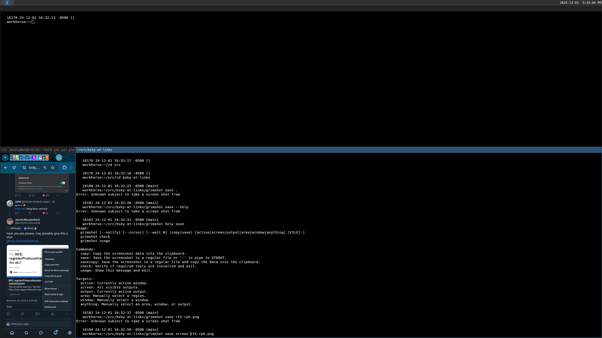

# bsky-at-links

> WebExtension to add at:// links to Bluesky social app

Adding `at://` (actually `web+at://`) protocol links to the Bluesky context menu.

Useful especially for easy navigation into [pdsls.dev](https://pdsls.dev), which will let you browse the underlying PDS for a post, via [`registerProtoclHandler` support](https://github.com/notjuliet/pdsls/issues/6).

# Example

Option menu with a `at://` link to the post:

https://bsky.app/profile/jauntywk.bsky.social/post/3lc2oa5rl6s2r

# Credits

Idea from https://bsky.app/profile/retr0.id/post/3lc2nldczxs2k
